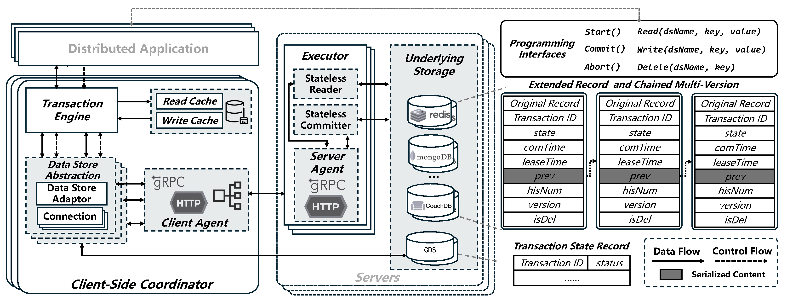

# Oreo - An Easy-to-use Distributed Transaction Framework

## Oreo

Oreo: High-Performance and Scalable Transactions across Heterogeneous NoSQL Data Stores

This repository is dedicated to sharing the implementation of Oreo for the ASPLOS 2025 paper entitled: Oreo: High-Performance and Scalable Transactions across Heterogeneous NoSQL Data Stores.

## Project Structure

## Getting Started

## Evaluation

## License

This project is licensed under the MIT License. See the [LICENSE](./LICENSE) file for details.